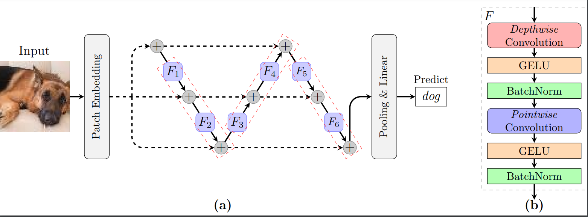

# sunyata
> Sunyata, a Buddhist concept, is what all existences arise. 
## Models
### FoldNet
FoldNet fold the chain-like architecture of ResNet to form an accordion-like neural network architecture:

The [model](sunyata/pytorch/arch/foldnet.py) and the [notebooks](notebooks/foldnet_tiny_imagenet.ipynb) to train on the Tiny ImageNet data are available.
